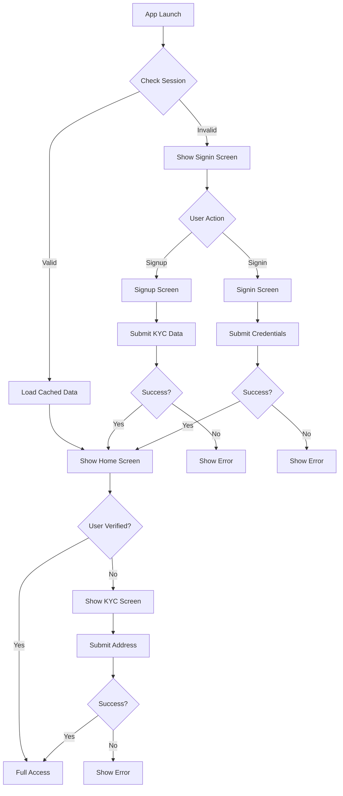
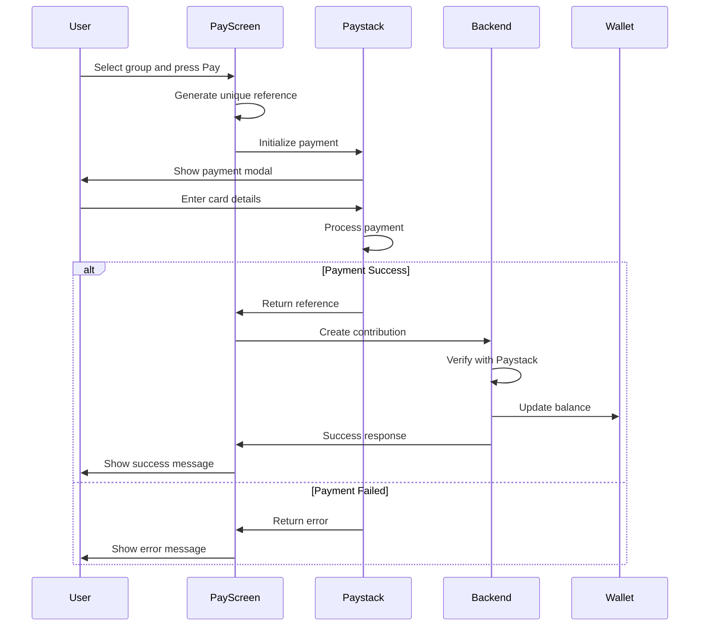

# Design Document: Mobile UI Backend Integration

## Overview

This design document specifies the implementation approach for connecting all mobile UI screens in the AjoSave React Native Expo application to the backend API. The feature builds upon existing service layers (authService, walletService, groupService, transactionService) and context providers (AuthContext, WalletContext, GroupsContext) to enable complete functionality across authentication, wallet management, savings groups, and payment processing.

### Objectives

- Connect all mobile screens to backend API through existing service layers
- Implement comprehensive form validation with user-friendly error messages
- Provide consistent loading states and error handling across all screens
- Enable offline data access through AsyncStorage caching
- Integrate Paystack payment gateway for contributions
- Maintain smooth navigation flow based on authentication state
- Ensure data consistency through proper state management

### Scope

This feature covers:
- Authentication screens (Signup, Signin, KYC)
- Dashboard and wallet screens (Home, Wallet)
- Group management screens (Groups list, Create, Join, Details)
- Payment screen (Pay with Paystack integration)
- Form validation patterns
- Loading and error state management
- Data caching strategy
- Navigation flow integration

Out of scope:
- Backend API implementation (already complete)
- Service layer implementation (already complete)
- Context provider implementation (already complete)
- UI component design changes
- Biometric authentication
- Push notifications

## Architecture

### System Architecture

The mobile application follows a layered architecture pattern:

```
┌─────────────────────────────────────────────────────────┐
│                    UI Layer (Screens)                    │
│  Signup, Signin, KYC, Home, Wallet, Groups, Pay, etc.  │
└────────────────────┬────────────────────────────────────┘
                     │
┌────────────────────▼────────────────────────────────────┐
│              Context Layer (State Management)            │
│        AuthContext, WalletContext, GroupsContext        │
└────────────────────┬────────────────────────────────────┘
                     │
┌────────────────────▼────────────────────────────────────┐
│                  Service Layer                           │
│  AuthService, WalletService, GroupService, Transaction  │
└────────────────────┬────────────────────────────────────┘
                     │
┌────────────────────▼────────────────────────────────────┐
│                  API Service                             │
│         HTTP Client with Cookie Management              │
└────────────────────┬────────────────────────────────────┘
                     │
┌────────────────────▼────────────────────────────────────┐
│                Backend REST API                          │
│           http://localhost:5000/api                      │
└─────────────────────────────────────────────────────────┘
```

### Data Flow

1. **User Action**: User interacts with UI (form submission, button press)
2. **Validation**: Screen validates input locally before submission
3. **Context Call**: Screen calls context method (e.g., `login()`, `createGroup()`)
4. **Service Call**: Context calls service layer method
5. **API Request**: Service makes HTTP request to backend
6. **Response Handling**: Service processes response, caches data if successful
7. **State Update**: Context updates state with new data
8. **UI Update**: Screen re-renders with updated state

### Authentication Flow



### State Management Strategy

The application uses React Context API for global state management with three primary contexts:

1. **AuthContext**: Manages authentication state and user data
   - State: `user`, `isAuthenticated`, `isLoading`
   - Actions: `login()`, `signup()`, `verifyUser()`, `logout()`
   - Persistence: User data cached in AsyncStorage

2. **WalletContext**: Manages wallet and transaction data
   - State: `wallet`, `transactions`, `isLoading`, `error`
   - Actions: `fetchWallet()`, `fetchTransactions()`, `refreshWallet()`
   - Computed: `totalContributed`, `totalReceived`, `pendingAmount`
   - Persistence: Wallet and transactions cached in AsyncStorage

3. **GroupsContext**: Manages groups data
   - State: `groups`, `selectedGroup`, `isLoading`, `error`
   - Actions: `fetchGroups()`, `createGroup()`, `joinGroup()`, `findGroupByCode()`
   - Persistence: Groups cached in AsyncStorage

### Caching Strategy

All data is cached in AsyncStorage for offline access:

| Data Type | Storage Key | Cache Trigger | Invalidation |
|-----------|-------------|---------------|--------------|
| User Data | `@user_data` | Login, Signup, Verify | Logout |
| Wallet Data | `@wallet_data` | Fetch Wallet | Logout, Refresh |
| Transactions | `@transactions_data` | Fetch Transactions | Logout, Refresh |
| Groups | `@groups_data` | Fetch Groups | Logout, Refresh |
| Group Details | `@group_{id}` | Fetch Group Details | Logout, Refresh |

Cache behavior:
- On app launch, load cached data immediately for instant UI
- Fetch fresh data in background and update UI when available
- On network error, continue showing cached data with staleness indicator
- On logout, clear all cached data

## Components and Interfaces

### Screen Components

#### 1. Signup Screen (`mobile/app/(auth)/signup.tsx`)

**Purpose**: Collect user registration data including KYC information

**State Management**:
```typescript
interface SignupFormState {
  firstName: string;
  lastName: string;
  email: string;
  phoneNumber: string;
  password: string;
  bvn: string;
  nin: string;
  dateOfBirth: string;
}

interface SignupFormErrors {
  firstName?: string;
  lastName?: string;
  email?: string;
  phoneNumber?: string;
  password?: string;
  bvn?: string;
  nin?: string;
  dateOfBirth?: string;
}
```

**Key Interactions**:
- Form input with real-time validation
- Date picker for dateOfBirth
- Numeric-only inputs for BVN and NIN
- Phone number formatting
- Submit button with loading state
- Error display below each field

**Context Integration**:
```typescript
const { signup, isLoading } = useAuth();
const router = useRouter();

const handleSubmit = async () => {
  try {
    await signup(formData);
    router.replace('/(tabs)/home');
  } catch (error) {
    setError(error.message);
  }
};
```

#### 2. Signin Screen (`mobile/app/(auth)/signin.tsx`)

**Purpose**: Authenticate existing users

**State Management**:
```typescript
interface SigninFormState {
  phoneNumber: string;
  password: string;
}

interface SigninFormErrors {
  phoneNumber?: string;
  password?: string;
}
```

**Key Interactions**:
- Phone number and password inputs
- Remember me checkbox (optional)
- Submit button with loading state
- Password visibility toggle
- Error display

**Context Integration**:
```typescript
const { login, isLoading } = useAuth();
const router = useRouter();

const handleSubmit = async () => {
  try {
    await login(phoneNumber, password);
    router.replace('/(tabs)/home');
  } catch (error) {
    setError(error.message);
    setPassword(''); // Clear password on error
  }
};
```

#### 3. KYC Verification Screen (`mobile/app/(auth)/kyc.tsx`)

**Purpose**: Complete user verification with address

**State Management**:
```typescript
interface KYCFormState {
  address: string;
}

interface KYCFormErrors {
  address?: string;
}
```

**Key Interactions**:
- Multi-line address input
- Submit button with loading state
- Error display

**Context Integration**:
```typescript
const { verifyUser, isLoading } = useAuth();
const router = useRouter();

const handleSubmit = async () => {
  try {
    await verifyUser(address);
    router.replace('/(tabs)/home');
  } catch (error) {
    setError(error.message);
  }
};
```

#### 4. Home Screen (`mobile/app/(tabs)/home.tsx`)

**Purpose**: Display dashboard with wallet summary and recent transactions

**State Management**:
```typescript
interface HomeScreenState {
  refreshing: boolean;
}
```

**Key Interactions**:
- Pull-to-refresh
- Wallet balance display
- Recent transactions list (5 items)
- Quick action buttons
- Loading skeletons

**Context Integration**:
```typescript
const { wallet, transactions, isLoading, error, fetchWallet, fetchTransactions, refreshWallet } = useWallet();

useEffect(() => {
  fetchWallet();
  fetchTransactions({ limit: 5 });
}, []);

const handleRefresh = async () => {
  setRefreshing(true);
  await refreshWallet();
  setRefreshing(false);
};
```

#### 5. Wallet Screen (`mobile/app/(tabs)/wallet.tsx`)

**Purpose**: Display complete transaction history and manage bank accounts

**State Management**:
```typescript
interface WalletScreenState {
  refreshing: boolean;
  bankAccounts: BankAccount[];
}
```

**Key Interactions**:
- Pull-to-refresh
- Transaction list with infinite scroll
- Bank accounts section
- Add bank account button
- Transaction filtering (optional)
- Loading skeletons

**Context Integration**:
```typescript
const { wallet, transactions, isLoading, fetchWallet, fetchTransactions, refreshWallet } = useWallet();
const [bankAccounts, setBankAccounts] = useState<BankAccount[]>([]);

useEffect(() => {
  fetchWallet();
  fetchTransactions();
  loadBankAccounts();
}, []);

const loadBankAccounts = async () => {
  const { bankAccounts } = await WalletService.getBankAccounts();
  setBankAccounts(bankAccounts);
};
```

#### 6. Groups Screen (`mobile/app/(tabs)/groups.tsx`)

**Purpose**: Display user's savings groups

**State Management**:
```typescript
interface GroupsScreenState {
  refreshing: boolean;
}
```

**Key Interactions**:
- Pull-to-refresh
- Groups list with status indicators
- Create group button
- Join group button
- Group item navigation to details
- Empty state
- Loading skeletons

**Context Integration**:
```typescript
const { groups, isLoading, error, fetchGroups, refreshGroups } = useGroups();
const router = useRouter();

useEffect(() => {
  fetchGroups();
}, []);

const handleGroupPress = (groupId: string) => {
  router.push(`/group-details?id=${groupId}`);
};
```

#### 7. Pay Screen (`mobile/app/(tabs)/pay.tsx`)

**Purpose**: Make contributions to active groups using Paystack

**State Management**:
```typescript
interface PayScreenState {
  selectedGroupId: string | null;
  paymentInProgress: boolean;
}
```

**Key Interactions**:
- Active groups list
- Group selection
- Pay button with amount display
- Paystack payment modal
- Success/error feedback
- Loading states

**Context Integration**:
```typescript
const { groups, fetchGroups, refreshGroups } = useGroups();
const { refreshWallet } = useWallet();
const [paymentInProgress, setPaymentInProgress] = useState(false);

const handlePayment = async (group: Group) => {
  setPaymentInProgress(true);
  
  try {
    // Initialize Paystack
    const paystackRef = await initializePaystack({
      email: user.email,
      amount: group.contributionAmount * 100, // Convert to kobo
      reference: generateReference(),
    });
    
    // On success, record contribution
    await TransactionService.createContribution(
      group._id,
      paystackRef,
      group.contributionAmount
    );
    
    // Refresh data
    await Promise.all([refreshWallet(), refreshGroups()]);
    
    Alert.alert('Success', 'Contribution recorded successfully');
  } catch (error) {
    Alert.alert('Payment Failed', error.message);
  } finally {
    setPaymentInProgress(false);
  }
};
```

#### 8. Create Group Screen (New)

**Purpose**: Create a new savings group

**State Management**:
```typescript
interface CreateGroupFormState {
  name: string;
  description: string;
  maxMembers: number;
  duration: number;
  contributionAmount: number;
  frequency: 'Weekly' | 'Bi-Weekly' | 'Monthly';
  payoutOrder: 'random' | 'firstCome' | 'bidding';
  emails?: string;
}

interface CreateGroupFormErrors {
  name?: string;
  maxMembers?: string;
  duration?: string;
  contributionAmount?: string;
  frequency?: string;
  payoutOrder?: string;
}
```

**Key Interactions**:
- Multi-step form or single form
- Numeric inputs with validation
- Dropdown selectors for frequency and payoutOrder
- Submit button with loading state
- Success modal with invitation code
- Share invitation code option

**Context Integration**:
```typescript
const { createGroup, isLoading } = useGroups();
const router = useRouter();

const handleSubmit = async () => {
  try {
    const { group, invitationCode } = await createGroup(formData);
    
    // Show success modal with invitation code
    Alert.alert(
      'Group Created!',
      `Invitation Code: ${invitationCode}`,
      [
        { text: 'Share Code', onPress: () => shareCode(invitationCode) },
        { text: 'View Group', onPress: () => router.push(`/group-details?id=${group._id}`) }
      ]
    );
  } catch (error) {
    setError(error.message);
  }
};
```

#### 9. Join Group Screen (New)

**Purpose**: Join an existing group using invitation code

**State Management**:
```typescript
interface JoinGroupFormState {
  invitationCode: string;
  foundGroup: Group | null;
}

interface JoinGroupFormErrors {
  invitationCode?: string;
}
```

**Key Interactions**:
- Invitation code input (auto-uppercase)
- Search button
- Group preview card
- Join button
- Loading states
- Error display

**Context Integration**:
```typescript
const { findGroupByCode, joinGroup, isLoading } = useGroups();
const router = useRouter();

const handleSearch = async () => {
  try {
    const group = await findGroupByCode(invitationCode);
    setFoundGroup(group);
  } catch (error) {
    setError('Group not found');
  }
};

const handleJoin = async () => {
  try {
    await joinGroup(foundGroup._id);
    router.push(`/group-details?id=${foundGroup._id}`);
  } catch (error) {
    setError(error.message);
  }
};
```

#### 10. Group Details Screen (New)

**Purpose**: Display detailed group information and member activity

**State Management**:
```typescript
interface GroupDetailsScreenState {
  refreshing: boolean;
}
```

**Key Interactions**:
- Pull-to-refresh
- Group information display
- Members list
- Contribution history
- Admin actions (if user is admin)
- Loading skeletons

**Context Integration**:
```typescript
const { selectedGroup, isLoading, fetchGroupDetails } = useGroups();
const { id } = useLocalSearchParams();

useEffect(() => {
  if (id) {
    fetchGroupDetails(id as string);
  }
}, [id]);

const handleRefresh = async () => {
  setRefreshing(true);
  await fetchGroupDetails(id as string);
  setRefreshing(false);
};
```

#### 11. Add Bank Account Screen (New)

**Purpose**: Add and verify bank account for payouts

**State Management**:
```typescript
interface AddBankAccountFormState {
  accountNumber: string;
  bankCode: string;
  bankName: string;
  accountName: string;
  isVerifying: boolean;
  isVerified: boolean;
}

interface AddBankAccountFormErrors {
  accountNumber?: string;
  bankCode?: string;
}
```

**Key Interactions**:
- Account number input (10 digits)
- Bank selection dropdown
- Verify button
- Account name display (after verification)
- Add button (after verification)
- Loading states

**Context Integration**:
```typescript
const { refreshWallet } = useWallet();
const router = useRouter();

const handleVerify = async () => {
  setIsVerifying(true);
  try {
    const verification = await WalletService.verifyBankAccount(accountNumber, bankCode);
    setAccountName(verification.accountName);
    setIsVerified(true);
  } catch (error) {
    setError('Invalid account details');
  } finally {
    setIsVerifying(false);
  }
};

const handleAdd = async () => {
  try {
    await WalletService.addBankAccount(accountNumber, accountName, bankCode, bankName);
    await refreshWallet();
    router.back();
  } catch (error) {
    setError(error.message);
  }
};
```

### Validation Utilities

Create a centralized validation utility module:

```typescript
// mobile/utils/validation.ts

export const ValidationRules = {
  firstName: {
    required: true,
    pattern: /^[A-Za-z]+$/,
    message: 'First name must contain only letters'
  },
  
  lastName: {
    required: true,
    pattern: /^[A-Za-z]+$/,
    message: 'Last name must contain only letters'
  },
  
  email: {
    required: true,
    pattern: /^[^\s@]+@[^\s@]+\.[^\s@]+$/,
    message: 'Please enter a valid email address'
  },
  
  phoneNumber: {
    required: true,
    pattern: /^(\+234|0)[789]\d{9}$/,
    message: 'Please enter a valid Nigerian phone number'
  },
  
  password: {
    required: true,
    minLength: 8,
    message: 'Password must be at least 8 characters long'
  },
  
  bvn: {
    required: true,
    pattern: /^\d{11}$/,
    message: 'BVN must be exactly 11 digits'
  },
  
  nin: {
    required: true,
    pattern: /^\d{11}$/,
    message: 'NIN must be exactly 11 digits'
  },
  
  dateOfBirth: {
    required: true,
    validate: (value: string) => {
      const date = new Date(value);
      const age = (new Date().getTime() - date.getTime()) / (1000 * 60 * 60 * 24 * 365);
      return age >= 18;
    },
    message: 'You must be at least 18 years old'
  },
  
  address: {
    required: true,
    minLength: 10,
    message: 'Address must be at least 10 characters long'
  },
  
  groupName: {
    required: true,
    minLength: 3,
    message: 'Group name must be at least 3 characters long'
  },
  
  maxMembers: {
    required: true,
    min: 2,
    max: 50,
    message: 'Max members must be between 2 and 50'
  },
  
  duration: {
    required: true,
    min: 1,
    max: 52,
    message: 'Duration must be between 1 and 52 weeks'
  },
  
  contributionAmount: {
    required: true,
    min: 1,
    message: 'Contribution amount must be greater than 0'
  },
  
  invitationCode: {
    required: true,
    pattern: /^[A-Z0-9]{6}$/,
    message: 'Invitation code must be exactly 6 characters'
  }
};

export function validateField(fieldName: string, value: any): string | null {
  const rule = ValidationRules[fieldName];
  if (!rule) return null;
  
  // Check required
  if (rule.required && (!value || value.toString().trim() === '')) {
    return `${fieldName} is required`;
  }
  
  // Check pattern
  if (rule.pattern && !rule.pattern.test(value)) {
    return rule.message;
  }
  
  // Check minLength
  if (rule.minLength && value.length < rule.minLength) {
    return rule.message;
  }
  
  // Check min/max
  if (rule.min !== undefined && Number(value) < rule.min) {
    return rule.message;
  }
  
  if (rule.max !== undefined && Number(value) > rule.max) {
    return rule.message;
  }
  
  // Check custom validation
  if (rule.validate && !rule.validate(value)) {
    return rule.message;
  }
  
  return null;
}

export function validateForm(formData: Record<string, any>, fields: string[]): Record<string, string> {
  const errors: Record<string, string> = {};
  
  fields.forEach(field => {
    const error = validateField(field, formData[field]);
    if (error) {
      errors[field] = error;
    }
  });
  
  return errors;
}
```

### Formatting Utilities

Create formatting utilities for consistent data display:

```typescript
// mobile/utils/formatting.ts

export function formatCurrency(amount: number): string {
  return `₦${amount.toLocaleString('en-NG', { minimumFractionDigits: 2, maximumFractionDigits: 2 })}`;
}

export function formatPhoneNumber(phone: string): string {
  // Format as: +234 XXX XXX XXXX
  const cleaned = phone.replace(/\D/g, '');
  if (cleaned.startsWith('234')) {
    return `+234 ${cleaned.slice(3, 6)} ${cleaned.slice(6, 9)} ${cleaned.slice(9)}`;
  }
  if (cleaned.startsWith('0')) {
    return `0${cleaned.slice(1, 4)} ${cleaned.slice(4, 7)} ${cleaned.slice(7)}`;
  }
  return phone;
}

export function formatDate(dateString: string): string {
  const date = new Date(dateString);
  return date.toLocaleDateString('en-NG', { 
    year: 'numeric', 
    month: 'short', 
    day: 'numeric' 
  });
}

export function formatDateTime(dateString: string): string {
  const date = new Date(dateString);
  return date.toLocaleString('en-NG', { 
    year: 'numeric', 
    month: 'short', 
    day: 'numeric',
    hour: '2-digit',
    minute: '2-digit'
  });
}

export function formatAccountNumber(accountNumber: string): string {
  // Format as: XXXX XXXX XX
  return accountNumber.replace(/(\d{4})(\d{4})(\d{2})/, '$1 $2 $3');
}

export function generatePaymentReference(): string {
  return `AJO_${Date.now()}_${Math.random().toString(36).substr(2, 9).toUpperCase()}`;
}
```

## Data Models

### Form State Models

All form state models are defined in the Components section above. Key models include:

- `SignupFormState` and `SignupFormErrors`
- `SigninFormState` and `SigninFormErrors`
- `KYCFormState` and `KYCFormErrors`
- `CreateGroupFormState` and `CreateGroupFormErrors`
- `JoinGroupFormState` and `JoinGroupFormErrors`
- `AddBankAccountFormState` and `AddBankAccountFormErrors`

### API Models

API models are already defined in the service layer:

- `User` (from AuthService)
- `Wallet` and `BankAccount` (from WalletService)
- `Group` and `GroupMember` (from GroupService)
- `Transaction` (from TransactionService)

These models are imported from service files and used throughout the application.


## Correctness Properties

*A property is a characteristic or behavior that should hold true across all valid executions of a system-essentially, a formal statement about what the system should do. Properties serve as the bridge between human-readable specifications and machine-verifiable correctness guarantees.*

After analyzing all acceptance criteria, I've identified the testable properties that can be verified through property-based testing. Many acceptance criteria are specific examples or UI integration tests that are better suited for unit testing rather than property-based testing.

### Property Reflection

Before defining the final properties, I reviewed all identified testable properties from the prework to eliminate redundancy:

- Validation properties (1.2-1.9, 2.2-2.3, 3.2, 8.2-8.7, 9.3) can be consolidated into a single comprehensive validation property
- Form error display properties (12.1, 12.3, 12.4, 12.5) can be combined into a comprehensive form validation UI property
- Loading state properties (13.1, 13.2, 13.5) can be combined into a comprehensive loading state property
- Error handling properties (14.1, 14.5, 14.7) can be combined into a comprehensive error handling property
- Input formatting properties (17.1-17.4, 17.6-17.7) can be combined into a comprehensive input formatting property

### Property 1: Form Field Validation

*For any* form field with validation rules, when the user submits the form, the validation function should return an error message if the input violates the rule, and return null if the input is valid.

**Validates: Requirements 1.2, 1.3, 1.4, 1.5, 1.6, 1.7, 1.8, 1.9, 2.2, 2.3, 3.2, 8.2, 8.3, 8.4, 8.5, 8.6, 8.7, 9.3**

### Property 2: Transaction Display Order

*For any* list of transactions, when displayed on the Wallet Screen, the transactions should be ordered in reverse chronological order (most recent first).

**Validates: Requirements 5.4**

### Property 3: Transaction Data Completeness

*For any* transaction displayed on the Wallet Screen, the rendered transaction item should include all required fields: type, amount, status, description, and date.

**Validates: Requirements 5.5**

### Property 4: Bank Account Data Completeness

*For any* bank account displayed on the Wallet Screen, the rendered account item should include all required fields: accountName, accountNumber, and bankName.

**Validates: Requirements 5.6**

### Property 5: Group Data Completeness

*For any* group displayed on the Groups Screen, the rendered group item should include all required fields: name, contributionAmount, frequency, status, and memberCount.

**Validates: Requirements 7.3**

### Property 6: Active Group Next Contribution Display

*For any* group with status "active", when displayed on the Groups Screen, the group item should show the nextContribution date.

**Validates: Requirements 7.4**

### Property 7: Active Group Filtering

*For any* list of groups, when displayed on the Pay Screen, only groups with status "active" should be included in the filtered list.

**Validates: Requirements 10.2**

### Property 8: Active Group Payment Data Completeness

*For any* active group displayed on the Pay Screen, the rendered group item should include both contributionAmount and nextContribution date.

**Validates: Requirements 10.3**

### Property 9: Group Member Data Completeness

*For any* member in a group's membersList, when displayed on the Group Details Screen, the rendered member item should include all required fields: name, role, status, and contribution statistics.

**Validates: Requirements 11.5**

### Property 10: Form Validation Error Display

*For any* form field that fails validation, the UI should display an error message below that field, and when the field is corrected to a valid value, the error message should be removed.

**Validates: Requirements 12.1, 12.3**

### Property 11: Form Submission Prevention

*For any* form with validation errors, when the user attempts to submit, the submission should be prevented and all invalid fields should be highlighted.

**Validates: Requirements 12.4**

### Property 12: Validation Error Message Specificity

*For any* validation rule, the error message displayed should be specific to that rule and clearly indicate what the user needs to correct.

**Validates: Requirements 12.5**

### Property 13: Loading State Management

*For any* API request, while the request is processing, a loading indicator should be displayed, and when the request completes (success or failure), the loading indicator should be removed.

**Validates: Requirements 13.1, 13.5**

### Property 14: Form Submit Button Disabling

*For any* form submission, while the form is submitting, the submit button should be disabled to prevent duplicate submissions.

**Validates: Requirements 13.2**

### Property 15: API Error Message Display

*For any* API request that fails, the error message returned from the backend should be displayed to the user.

**Validates: Requirements 14.1**

### Property 16: Critical Operation Error Logging

*For any* error that occurs during a critical operation (authentication, payment, group creation), the error details should be logged for debugging purposes.

**Validates: Requirements 14.5**

### Property 17: Retry Button Functionality

*For any* error that has a retry option, a retry button should be provided that, when pressed, repeats the failed operation.

**Validates: Requirements 14.7**

### Property 18: Phone Number Input Formatting

*For any* phone number input, as the user types, the input should be automatically formatted according to Nigerian phone number format.

**Validates: Requirements 17.1**

### Property 19: Numeric Input Restriction

*For any* numeric-only field (BVN, NIN), the input should restrict entry to numeric characters only, rejecting any non-numeric characters.

**Validates: Requirements 17.2, 17.3**

### Property 20: Currency Input Formatting

*For any* currency amount input, the input should restrict entry to numeric characters and automatically format the display with currency symbol and thousand separators.

**Validates: Requirements 17.4, 17.7**

### Property 21: Invitation Code Uppercase Transformation

*For any* invitation code input, as the user types, the input should be automatically converted to uppercase.

**Validates: Requirements 9.2, 17.6**


## Error Handling

### Error Handling Strategy

The application implements a comprehensive error handling strategy across all layers:

1. **Validation Errors**: Caught at the UI layer before API calls
2. **Network Errors**: Handled by the API service layer
3. **API Errors**: Returned from backend and displayed to users
4. **Authentication Errors**: Trigger logout and navigation to signin
5. **Critical Errors**: Logged for debugging and monitoring

### Error Types and Handling

#### 1. Validation Errors

**Source**: Client-side form validation

**Handling**:
- Display error message below the invalid field
- Prevent form submission
- Highlight all invalid fields
- Provide specific, actionable error messages

**Example**:
```typescript
const errors = validateForm(formData, ['firstName', 'lastName', 'email']);
if (Object.keys(errors).length > 0) {
  setFormErrors(errors);
  return; // Prevent submission
}
```

#### 2. Network Errors

**Source**: No internet connection or network timeout

**Handling**:
- Display "No internet connection" message
- Show cached data if available with staleness indicator
- Provide retry button
- Auto-retry when connection is restored

**Example**:
```typescript
try {
  await fetchWallet();
} catch (error) {
  if (error.message.includes('Network')) {
    setError('No internet connection. Showing cached data.');
    // Display cached data
  }
}
```

#### 3. Authentication Errors (401)

**Source**: Invalid or expired session

**Handling**:
- Automatically log user out
- Clear all cached data
- Navigate to signin screen
- Display "Session expired" message

**Example**:
```typescript
// In API service layer
if (response.status === 401) {
  await AuthService.logout();
  router.replace('/(auth)/signin');
  throw new Error('Session expired. Please sign in again.');
}
```

#### 4. Server Errors (500)

**Source**: Backend server errors

**Handling**:
- Display generic error message
- Provide retry button
- Log error details for debugging
- Don't expose internal error details to users

**Example**:
```typescript
if (response.status === 500) {
  console.error('Server error:', error);
  setError('Something went wrong. Please try again.');
}
```

#### 5. Business Logic Errors (400, 403, 404)

**Source**: Invalid requests or forbidden actions

**Handling**:
- Display specific error message from backend
- Provide guidance on how to resolve
- No retry button (user action required)

**Example**:
```typescript
// Backend returns: "Group is full"
setError('This group has reached maximum members. Try joining a different group.');
```

#### 6. Payment Errors

**Source**: Paystack payment failures

**Handling**:
- Display Paystack error message
- Provide payment reference for support
- Don't retry automatically (user decision)
- Log payment details for reconciliation

**Example**:
```typescript
try {
  const reference = await processPayment(amount);
  await recordContribution(groupId, reference);
} catch (error) {
  if (error.source === 'paystack') {
    Alert.alert(
      'Payment Failed',
      `${error.message}\n\nReference: ${error.reference}\n\nPlease contact support if you were charged.`
    );
  }
}
```

### Error Display Patterns

#### 1. Inline Field Errors

Used for form validation errors:

```typescript
<TextInput
  value={email}
  onChangeText={setEmail}
  error={errors.email}
/>
{errors.email && (
  <Text style={styles.errorText}>{errors.email}</Text>
)}
```

#### 2. Alert Dialogs

Used for critical errors requiring user acknowledgment:

```typescript
Alert.alert(
  'Error',
  'Failed to create group. Please try again.',
  [{ text: 'OK' }]
);
```

#### 3. Toast Notifications

Used for non-critical errors and success messages:

```typescript
Toast.show({
  type: 'error',
  text1: 'Failed to load data',
  text2: 'Pull to refresh to try again'
});
```

#### 4. Error Banners

Used for persistent errors with retry options:

```typescript
{error && (
  <View style={styles.errorBanner}>
    <Text>{error}</Text>
    <Button title="Retry" onPress={handleRetry} />
  </View>
)}
```

### Error Recovery Patterns

#### 1. Retry with Exponential Backoff

For transient network errors:

```typescript
async function retryWithBackoff(fn, maxRetries = 3) {
  for (let i = 0; i < maxRetries; i++) {
    try {
      return await fn();
    } catch (error) {
      if (i === maxRetries - 1) throw error;
      await new Promise(resolve => setTimeout(resolve, Math.pow(2, i) * 1000));
    }
  }
}
```

#### 2. Fallback to Cached Data

For data fetching errors:

```typescript
try {
  const data = await fetchWallet();
  setWallet(data);
} catch (error) {
  const cachedData = await StorageService.get(STORAGE_KEYS.WALLET_DATA);
  if (cachedData) {
    setWallet(cachedData);
    setDataStale(true);
  }
}
```

#### 3. Graceful Degradation

For non-critical feature failures:

```typescript
try {
  const stats = await getGroupStats(groupId);
  setStats(stats);
} catch (error) {
  // Continue without stats - not critical
  console.warn('Failed to load stats:', error);
}
```

### Error Logging

All errors are logged with context for debugging:

```typescript
function logError(error: Error, context: Record<string, any>) {
  console.error('Error:', {
    message: error.message,
    stack: error.stack,
    context,
    timestamp: new Date().toISOString(),
    userId: context.userId,
    screen: context.screen,
  });
  
  // In production, send to error tracking service
  if (__DEV__ === false) {
    ErrorTrackingService.captureException(error, context);
  }
}
```


## Testing Strategy

### Overview

The testing strategy employs a dual approach combining unit tests and property-based tests to ensure comprehensive coverage:

- **Unit Tests**: Verify specific examples, edge cases, integration points, and UI behavior
- **Property-Based Tests**: Verify universal properties across all possible inputs

Both testing approaches are complementary and necessary for comprehensive coverage. Unit tests catch concrete bugs in specific scenarios, while property-based tests verify general correctness across a wide range of inputs.

### Testing Framework Selection

**Unit Testing**:
- Framework: Jest + React Native Testing Library
- Mocking: Jest mocks for services and contexts
- UI Testing: @testing-library/react-native for component testing

**Property-Based Testing**:
- Framework: fast-check (JavaScript property-based testing library)
- Configuration: Minimum 100 iterations per property test
- Integration: Works seamlessly with Jest

### Property-Based Testing Configuration

Each property test must:
1. Run minimum 100 iterations to ensure comprehensive input coverage
2. Include a comment tag referencing the design document property
3. Use fast-check generators for input generation
4. Test the universal property across all generated inputs

**Tag Format**:
```typescript
// Feature: mobile-ui-backend-integration, Property 1: Form Field Validation
```

**Example Property Test**:
```typescript
import fc from 'fast-check';

describe('Property 1: Form Field Validation', () => {
  // Feature: mobile-ui-backend-integration, Property 1: Form Field Validation
  it('should validate all form fields according to their rules', () => {
    fc.assert(
      fc.property(
        fc.string(), // Generate random strings
        (input) => {
          const error = validateField('firstName', input);
          
          // Property: If input contains only letters and is not empty, no error
          if (input.length > 0 && /^[A-Za-z]+$/.test(input)) {
            expect(error).toBeNull();
          } else {
            expect(error).not.toBeNull();
          }
        }
      ),
      { numRuns: 100 } // Minimum 100 iterations
    );
  });
});
```

### Unit Testing Strategy

#### 1. Screen Component Tests

Test each screen component for:
- Rendering with correct initial state
- User interactions (button presses, form submissions)
- Context integration (calling correct methods)
- Navigation behavior
- Loading states
- Error states

**Example**:
```typescript
describe('SignupScreen', () => {
  it('should render all form fields', () => {
    const { getByPlaceholderText } = render(<SignupScreen />);
    expect(getByPlaceholderText('First Name')).toBeTruthy();
    expect(getByPlaceholderText('Last Name')).toBeTruthy();
    expect(getByPlaceholderText('Email')).toBeTruthy();
    // ... other fields
  });
  
  it('should call signup when form is submitted with valid data', async () => {
    const mockSignup = jest.fn();
    const { getByText, getByPlaceholderText } = render(
      <AuthContext.Provider value={{ signup: mockSignup }}>
        <SignupScreen />
      </AuthContext.Provider>
    );
    
    fireEvent.changeText(getByPlaceholderText('First Name'), 'John');
    fireEvent.changeText(getByPlaceholderText('Last Name'), 'Doe');
    // ... fill other fields
    
    fireEvent.press(getByText('Sign Up'));
    
    await waitFor(() => {
      expect(mockSignup).toHaveBeenCalledWith(expect.objectContaining({
        firstName: 'John',
        lastName: 'Doe',
      }));
    });
  });
  
  it('should display loading state while signup is processing', async () => {
    const mockSignup = jest.fn(() => new Promise(resolve => setTimeout(resolve, 1000)));
    const { getByText } = render(
      <AuthContext.Provider value={{ signup: mockSignup, isLoading: true }}>
        <SignupScreen />
      </AuthContext.Provider>
    );
    
    expect(getByText('Loading...')).toBeTruthy();
    expect(getByText('Sign Up')).toBeDisabled();
  });
});
```

#### 2. Validation Utility Tests

Test validation functions with:
- Valid inputs (should return null)
- Invalid inputs (should return error message)
- Edge cases (empty strings, special characters, boundary values)

**Example**:
```typescript
describe('validateField', () => {
  describe('firstName validation', () => {
    it('should accept valid first names', () => {
      expect(validateField('firstName', 'John')).toBeNull();
      expect(validateField('firstName', 'Mary')).toBeNull();
    });
    
    it('should reject empty first names', () => {
      expect(validateField('firstName', '')).toBe('firstName is required');
    });
    
    it('should reject first names with numbers', () => {
      expect(validateField('firstName', 'John123')).toBe('First name must contain only letters');
    });
    
    it('should reject first names with special characters', () => {
      expect(validateField('firstName', 'John@')).toBe('First name must contain only letters');
    });
  });
  
  describe('BVN validation', () => {
    it('should accept valid 11-digit BVN', () => {
      expect(validateField('bvn', '12345678901')).toBeNull();
    });
    
    it('should reject BVN with less than 11 digits', () => {
      expect(validateField('bvn', '1234567890')).toBe('BVN must be exactly 11 digits');
    });
    
    it('should reject BVN with more than 11 digits', () => {
      expect(validateField('bvn', '123456789012')).toBe('BVN must be exactly 11 digits');
    });
    
    it('should reject BVN with non-numeric characters', () => {
      expect(validateField('bvn', '1234567890a')).toBe('BVN must be exactly 11 digits');
    });
  });
});
```

#### 3. Formatting Utility Tests

Test formatting functions with:
- Various input formats
- Edge cases (empty, null, undefined)
- Boundary values

**Example**:
```typescript
describe('formatCurrency', () => {
  it('should format currency with Naira symbol and thousand separators', () => {
    expect(formatCurrency(1000)).toBe('₦1,000.00');
    expect(formatCurrency(1000000)).toBe('₦1,000,000.00');
    expect(formatCurrency(0)).toBe('₦0.00');
  });
});

describe('formatPhoneNumber', () => {
  it('should format Nigerian phone numbers', () => {
    expect(formatPhoneNumber('08012345678')).toBe('0801 234 5678');
    expect(formatPhoneNumber('2348012345678')).toBe('+234 801 234 5678');
  });
});
```

#### 4. Context Provider Tests

Test context providers for:
- Initial state
- State updates after actions
- Error handling
- Caching behavior

**Example**:
```typescript
describe('AuthContext', () => {
  it('should initialize with unauthenticated state', () => {
    const { result } = renderHook(() => useAuth(), {
      wrapper: AuthProvider,
    });
    
    expect(result.current.isAuthenticated).toBe(false);
    expect(result.current.user).toBeNull();
  });
  
  it('should update state after successful login', async () => {
    const mockUser = { id: '1', email: 'test@example.com' };
    jest.spyOn(AuthService, 'login').mockResolvedValue({ user: mockUser });
    
    const { result } = renderHook(() => useAuth(), {
      wrapper: AuthProvider,
    });
    
    await act(async () => {
      await result.current.login('08012345678', 'password');
    });
    
    expect(result.current.isAuthenticated).toBe(true);
    expect(result.current.user).toEqual(mockUser);
  });
  
  it('should handle login errors', async () => {
    jest.spyOn(AuthService, 'login').mockRejectedValue(new Error('Invalid credentials'));
    
    const { result } = renderHook(() => useAuth(), {
      wrapper: AuthProvider,
    });
    
    await expect(
      result.current.login('08012345678', 'wrong')
    ).rejects.toThrow('Invalid credentials');
    
    expect(result.current.isAuthenticated).toBe(false);
  });
});
```

#### 5. Integration Tests

Test integration between screens and contexts:
- Data flow from context to screen
- Screen updates after context state changes
- Navigation after successful operations

**Example**:
```typescript
describe('Home Screen Integration', () => {
  it('should display wallet data from context', async () => {
    const mockWallet = {
      availableBalance: 10000,
      totalContributions: 5000,
      totalPayouts: 2000,
    };
    
    const { getByText } = render(
      <WalletContext.Provider value={{ wallet: mockWallet }}>
        <HomeScreen />
      </WalletContext.Provider>
    );
    
    expect(getByText('₦10,000.00')).toBeTruthy();
    expect(getByText('₦5,000.00')).toBeTruthy();
    expect(getByText('₦2,000.00')).toBeTruthy();
  });
});
```

### Property-Based Test Cases

#### Property 1: Form Field Validation
```typescript
// Feature: mobile-ui-backend-integration, Property 1: Form Field Validation
describe('Property 1: Form Field Validation', () => {
  it('should validate firstName correctly for all inputs', () => {
    fc.assert(
      fc.property(fc.string(), (input) => {
        const error = validateField('firstName', input);
        const isValid = input.length > 0 && /^[A-Za-z]+$/.test(input);
        expect(error === null).toBe(isValid);
      }),
      { numRuns: 100 }
    );
  });
  
  it('should validate email correctly for all inputs', () => {
    fc.assert(
      fc.property(fc.string(), (input) => {
        const error = validateField('email', input);
        const isValid = /^[^\s@]+@[^\s@]+\.[^\s@]+$/.test(input);
        expect(error === null).toBe(isValid);
      }),
      { numRuns: 100 }
    );
  });
  
  it('should validate BVN correctly for all inputs', () => {
    fc.assert(
      fc.property(fc.string(), (input) => {
        const error = validateField('bvn', input);
        const isValid = /^\d{11}$/.test(input);
        expect(error === null).toBe(isValid);
      }),
      { numRuns: 100 }
    );
  });
});
```

#### Property 2: Transaction Display Order
```typescript
// Feature: mobile-ui-backend-integration, Property 2: Transaction Display Order
describe('Property 2: Transaction Display Order', () => {
  it('should display transactions in reverse chronological order', () => {
    fc.assert(
      fc.property(
        fc.array(fc.record({
          _id: fc.string(),
          createdAt: fc.date().map(d => d.toISOString()),
          amount: fc.nat(),
        })),
        (transactions) => {
          const sorted = sortTransactions(transactions);
          
          for (let i = 0; i < sorted.length - 1; i++) {
            const current = new Date(sorted[i].createdAt);
            const next = new Date(sorted[i + 1].createdAt);
            expect(current >= next).toBe(true);
          }
        }
      ),
      { numRuns: 100 }
    );
  });
});
```

#### Property 7: Active Group Filtering
```typescript
// Feature: mobile-ui-backend-integration, Property 7: Active Group Filtering
describe('Property 7: Active Group Filtering', () => {
  it('should filter only active groups', () => {
    fc.assert(
      fc.property(
        fc.array(fc.record({
          _id: fc.string(),
          name: fc.string(),
          status: fc.constantFrom('pending', 'active', 'completed', 'cancelled'),
        })),
        (groups) => {
          const filtered = filterActiveGroups(groups);
          
          // All filtered groups should be active
          filtered.forEach(group => {
            expect(group.status).toBe('active');
          });
          
          // All active groups should be in filtered list
          const activeCount = groups.filter(g => g.status === 'active').length;
          expect(filtered.length).toBe(activeCount);
        }
      ),
      { numRuns: 100 }
    );
  });
});
```

#### Property 18: Phone Number Input Formatting
```typescript
// Feature: mobile-ui-backend-integration, Property 18: Phone Number Input Formatting
describe('Property 18: Phone Number Input Formatting', () => {
  it('should format phone numbers consistently', () => {
    fc.assert(
      fc.property(
        fc.string({ minLength: 11, maxLength: 14 }).filter(s => /^\d+$/.test(s)),
        (input) => {
          const formatted = formatPhoneNumber(input);
          
          // Formatted output should contain spaces
          if (input.length >= 11) {
            expect(formatted).toContain(' ');
          }
          
          // Formatted output should preserve all digits
          const digitsIn = input.replace(/\D/g, '');
          const digitsOut = formatted.replace(/\D/g, '');
          expect(digitsOut).toBe(digitsIn);
        }
      ),
      { numRuns: 100 }
    );
  });
});
```

#### Property 21: Invitation Code Uppercase Transformation
```typescript
// Feature: mobile-ui-backend-integration, Property 21: Invitation Code Uppercase Transformation
describe('Property 21: Invitation Code Uppercase Transformation', () => {
  it('should convert invitation codes to uppercase', () => {
    fc.assert(
      fc.property(
        fc.string({ minLength: 6, maxLength: 6 }),
        (input) => {
          const transformed = transformInvitationCode(input);
          expect(transformed).toBe(input.toUpperCase());
        }
      ),
      { numRuns: 100 }
    );
  });
});
```

### Test Coverage Goals

- **Unit Test Coverage**: Minimum 80% code coverage
- **Property Test Coverage**: All identified properties (21 properties)
- **Integration Test Coverage**: All critical user flows
- **E2E Test Coverage**: Main user journeys (signup, login, create group, make payment)

### Testing Best Practices

1. **Isolation**: Mock external dependencies (API calls, navigation, storage)
2. **Determinism**: Use fixed dates/times in tests, avoid random data in unit tests
3. **Clarity**: Use descriptive test names that explain what is being tested
4. **Maintainability**: Keep tests simple and focused on one behavior
5. **Speed**: Unit tests should run quickly (< 1 second each)
6. **Property Tests**: Use generators that cover edge cases (empty, null, boundary values)

### Continuous Integration

All tests should run on:
- Pre-commit hooks (fast unit tests only)
- Pull request creation (all tests)
- Main branch merge (all tests + coverage report)
- Nightly builds (all tests + E2E tests)


## Paystack Integration Architecture

### Overview

Paystack is integrated for processing contribution payments. The integration follows Paystack's React Native SDK pattern with proper error handling and transaction verification.

### Integration Flow



### Paystack Configuration

**Environment Variables**:
```bash
# .env
EXPO_PUBLIC_PAYSTACK_PUBLIC_KEY=pk_test_xxxxxxxxxxxxx
```

**Paystack SDK Installation**:
```bash
npm install react-native-paystack-webview
```

### Payment Implementation

#### 1. Initialize Payment

```typescript
import { Paystack } from 'react-native-paystack-webview';

const PayScreen = () => {
  const { user } = useAuth();
  const paystackWebViewRef = useRef();
  
  const handlePayment = (group: Group) => {
    const reference = generatePaymentReference();
    
    paystackWebViewRef.current.startTransaction();
  };
  
  return (
    <Paystack
      paystackKey={process.env.EXPO_PUBLIC_PAYSTACK_PUBLIC_KEY}
      amount={group.contributionAmount * 100} // Convert to kobo
      billingEmail={user.email}
      billingName={`${user.firstName} ${user.lastName}`}
      billingMobile={user.phoneNumber}
      activityIndicatorColor="green"
      onCancel={(e) => {
        Alert.alert('Payment Cancelled', 'You cancelled the payment');
      }}
      onSuccess={(res) => {
        handlePaymentSuccess(res.reference, group);
      }}
      ref={paystackWebViewRef}
    />
  );
};
```

#### 2. Generate Payment Reference

```typescript
function generatePaymentReference(): string {
  const timestamp = Date.now();
  const random = Math.random().toString(36).substr(2, 9).toUpperCase();
  return `AJO_${timestamp}_${random}`;
}
```

#### 3. Handle Payment Success

```typescript
const handlePaymentSuccess = async (reference: string, group: Group) => {
  try {
    setPaymentInProgress(true);
    
    // Record contribution on backend
    const result = await TransactionService.createContribution(
      group._id,
      reference,
      group.contributionAmount
    );
    
    // Refresh wallet and groups data
    await Promise.all([
      refreshWallet(),
      refreshGroups(),
    ]);
    
    // Show success message
    Alert.alert(
      'Payment Successful',
      `Your contribution of ${formatCurrency(group.contributionAmount)} has been recorded.\n\nTransaction ID: ${result.transaction.transactionId}`,
      [{ text: 'OK' }]
    );
  } catch (error) {
    // Handle contribution recording failure
    Alert.alert(
      'Payment Verification Failed',
      `Your payment was successful but we couldn't verify it.\n\nReference: ${reference}\n\nPlease contact support with this reference.`,
      [
        { text: 'Copy Reference', onPress: () => Clipboard.setString(reference) },
        { text: 'OK' }
      ]
    );
  } finally {
    setPaymentInProgress(false);
  }
};
```

#### 4. Handle Payment Errors

```typescript
const handlePaymentError = (error: any) => {
  console.error('Payment error:', error);
  
  let errorMessage = 'Payment failed. Please try again.';
  
  if (error.message) {
    errorMessage = error.message;
  }
  
  Alert.alert('Payment Failed', errorMessage);
};
```

### Security Considerations

1. **Public Key Only**: Only use Paystack public key in mobile app
2. **Server-Side Verification**: Backend verifies all payments with Paystack
3. **No Card Storage**: Never store card details in the app
4. **Reference Uniqueness**: Generate unique references for each transaction
5. **Amount Validation**: Backend validates amount matches group contribution

### Payment States

The Pay Screen manages multiple payment states:

```typescript
interface PaymentState {
  selectedGroup: Group | null;
  paymentInProgress: boolean;
  paymentReference: string | null;
  paymentError: string | null;
}
```

### Error Scenarios

1. **Payment Cancelled**: User closes payment modal
   - Action: Show cancellation message, no backend call

2. **Payment Failed**: Paystack rejects payment
   - Action: Show error message, allow retry

3. **Payment Success, Recording Failed**: Payment succeeded but backend call failed
   - Action: Show error with reference, advise to contact support

4. **Network Error During Payment**: Connection lost during payment
   - Action: Show error, provide reference if available

### Testing Paystack Integration

**Test Mode**:
- Use test public key: `pk_test_xxxxxxxxxxxxx`
- Use test cards provided by Paystack
- Test card: 4084084084084081 (Success)
- Test card: 4084084084084081 (Decline)

**Test Scenarios**:
1. Successful payment flow
2. Payment cancellation
3. Payment decline
4. Network error during payment
5. Backend verification failure

## Implementation Notes

### Development Workflow

1. **Phase 1: Authentication Screens** (Week 1)
   - Update Signup screen with KYC fields
   - Update Signin screen with phone number
   - Update KYC screen with address
   - Implement validation utilities
   - Test authentication flow

2. **Phase 2: Dashboard and Wallet** (Week 1-2)
   - Update Home screen with wallet data
   - Update Wallet screen with transactions
   - Implement Add Bank Account flow
   - Test data display and caching

3. **Phase 3: Groups Management** (Week 2-3)
   - Update Groups screen
   - Implement Create Group flow
   - Implement Join Group flow
   - Implement Group Details screen
   - Test group operations

4. **Phase 4: Payment Integration** (Week 3)
   - Integrate Paystack SDK
   - Update Pay screen
   - Implement payment flow
   - Test payment scenarios

5. **Phase 5: Polish and Testing** (Week 4)
   - Implement error handling
   - Add loading states
   - Implement caching
   - Write tests
   - Fix bugs

### Code Organization

```
mobile/
├── app/
│   ├── (auth)/
│   │   ├── signup.tsx          # Updated with KYC fields
│   │   ├── signin.tsx          # Updated with phone number
│   │   └── kyc.tsx             # Updated with address
│   ├── (tabs)/
│   │   ├── home.tsx            # Updated with wallet data
│   │   ├── wallet.tsx          # Updated with transactions
│   │   ├── groups.tsx          # Updated with groups list
│   │   └── pay.tsx             # Updated with Paystack
│   └── (screens)/
│       ├── create-group.tsx    # New screen
│       ├── join-group.tsx      # New screen
│       ├── group-details.tsx   # New screen
│       └── add-bank-account.tsx # New screen
├── utils/
│   ├── validation.ts           # Validation utilities
│   ├── formatting.ts           # Formatting utilities
│   └── payment.ts              # Payment utilities
├── components/
│   ├── LoadingSkeleton.tsx     # Loading skeleton component
│   ├── ErrorBanner.tsx         # Error banner component
│   └── FormField.tsx           # Form field with validation
└── __tests__/
    ├── validation.test.ts      # Validation tests
    ├── formatting.test.ts      # Formatting tests
    └── properties/             # Property-based tests
        ├── validation.property.test.ts
        ├── sorting.property.test.ts
        └── formatting.property.test.ts
```

### Dependencies

**Required Packages**:
```json
{
  "dependencies": {
    "react-native-paystack-webview": "^3.4.0",
    "@react-native-async-storage/async-storage": "^1.19.0",
    "react-native-toast-message": "^2.1.6"
  },
  "devDependencies": {
    "@testing-library/react-native": "^12.3.0",
    "@testing-library/jest-native": "^5.4.3",
    "fast-check": "^3.13.0",
    "jest": "^29.7.0"
  }
}
```

### Environment Configuration

```bash
# .env
EXPO_PUBLIC_API_URL=http://localhost:5000/api
EXPO_PUBLIC_PAYSTACK_PUBLIC_KEY=pk_test_xxxxxxxxxxxxx

# .env.production
EXPO_PUBLIC_API_URL=https://api.ajosave.com/api
EXPO_PUBLIC_PAYSTACK_PUBLIC_KEY=pk_live_xxxxxxxxxxxxx
```

### Performance Considerations

1. **Lazy Loading**: Load screens on demand using React.lazy
2. **Memoization**: Use React.memo for expensive components
3. **Debouncing**: Debounce search and filter inputs
4. **Pagination**: Implement pagination for transaction lists
5. **Image Optimization**: Optimize images and use caching
6. **Bundle Size**: Monitor and optimize bundle size

### Accessibility

1. **Screen Readers**: Add accessibility labels to all interactive elements
2. **Color Contrast**: Ensure sufficient color contrast for text
3. **Touch Targets**: Minimum 44x44 points for touch targets
4. **Focus Management**: Proper focus order for form fields
5. **Error Announcements**: Announce errors to screen readers

### Internationalization (Future)

While not in current scope, the architecture supports future i18n:

```typescript
// utils/i18n.ts
export const translations = {
  en: {
    'signup.title': 'Create Account',
    'signup.firstName': 'First Name',
    // ...
  },
  // Future: Add other languages
};
```

### Monitoring and Analytics

Track key metrics:
- Authentication success/failure rates
- Payment success/failure rates
- API response times
- Error rates by type
- User journey completion rates
- Screen load times

### Security Best Practices

1. **Input Sanitization**: Sanitize all user inputs
2. **Secure Storage**: Use secure storage for sensitive data
3. **HTTPS Only**: All API calls over HTTPS
4. **Token Management**: Proper JWT token handling
5. **Payment Security**: Follow PCI DSS guidelines
6. **Data Encryption**: Encrypt sensitive data at rest

### Deployment Checklist

- [ ] Update environment variables for production
- [ ] Test all flows on physical devices
- [ ] Verify Paystack integration in production mode
- [ ] Test offline functionality
- [ ] Verify error handling
- [ ] Check accessibility compliance
- [ ] Run performance profiling
- [ ] Update app version and build number
- [ ] Generate release builds
- [ ] Submit to app stores

## Conclusion

This design document provides a comprehensive blueprint for implementing complete backend integration across all mobile UI screens. The architecture leverages existing service layers and context providers while adding robust validation, error handling, and payment processing capabilities. The dual testing strategy ensures both specific scenarios and universal properties are thoroughly validated.

